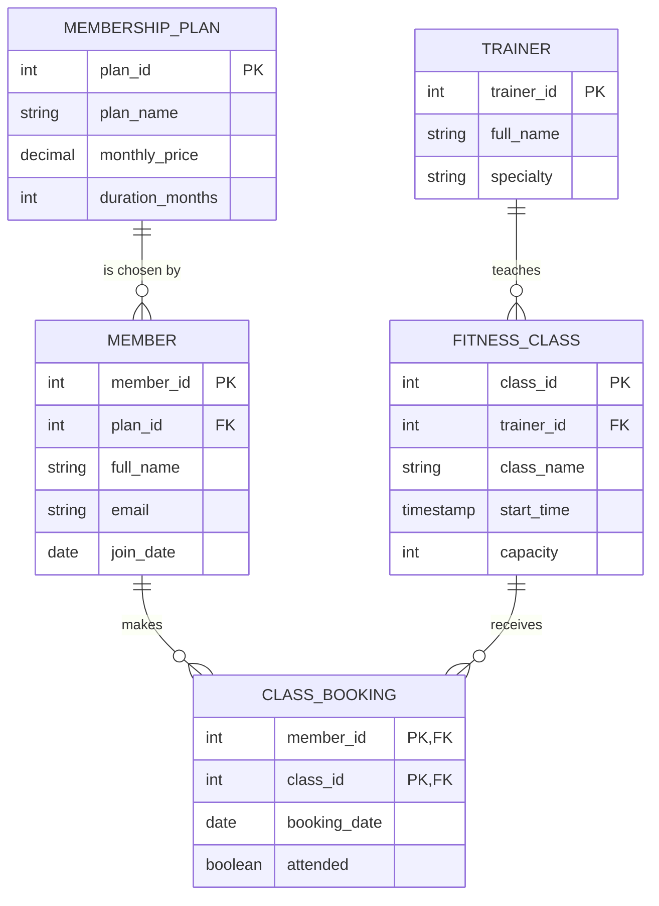

# ER Diyagramı

```mermaid
erDiagram
    MEMBERSHIP_PLAN ||--o{ MEMBER : "is chosen by"
    TRAINER         ||--o{ FITNESS_CLASS : "teaches"
    MEMBER          ||--o{ CLASS_BOOKING : "makes"
    FITNESS_CLASS   ||--o{ CLASS_BOOKING : "receives"

    MEMBERSHIP_PLAN {
        int plan_id PK
        string plan_name
        decimal monthly_price
        int duration_months
    }
    MEMBER {
        int member_id PK
        int plan_id FK
        string full_name
        string email
        date join_date
    }
    TRAINER {
        int trainer_id PK
        string full_name
        string specialty
    }
    FITNESS_CLASS {
        int class_id PK
        int trainer_id FK
        string class_name
        timestamp start_time
        int capacity
    }
    CLASS_BOOKING {
        int member_id PK, FK
        int class_id PK, FK
        date booking_date
        boolean attended
    }
```